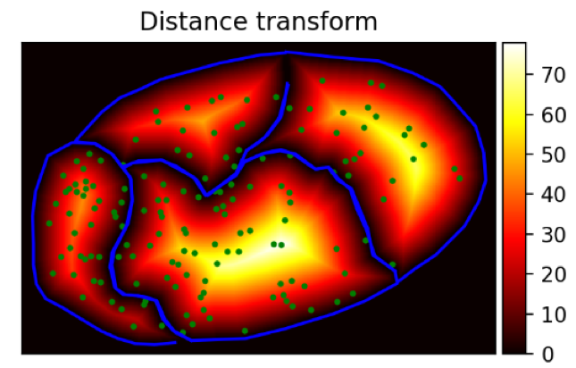
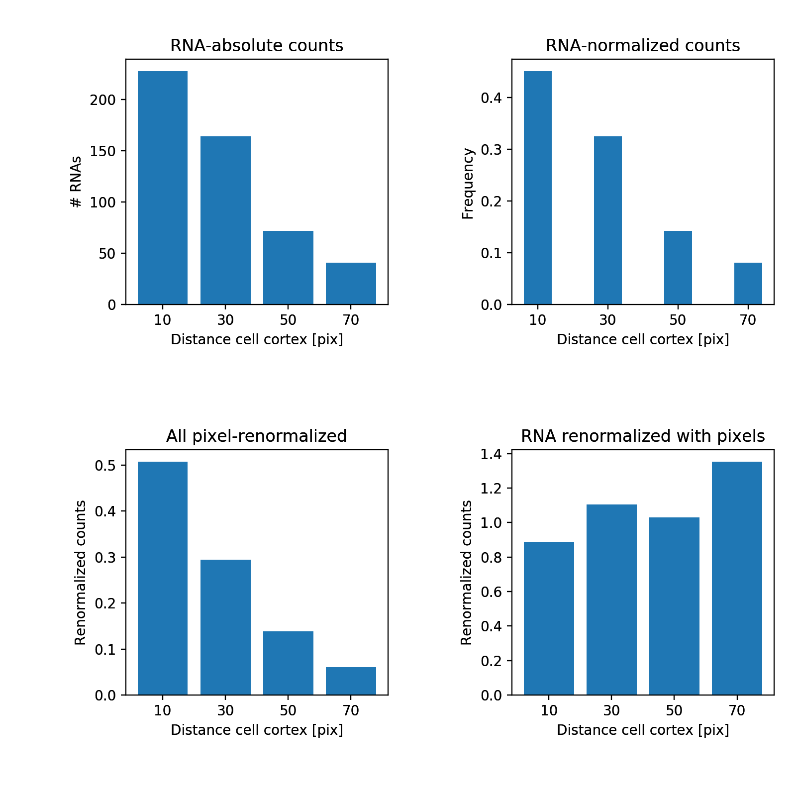
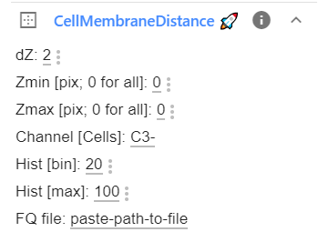
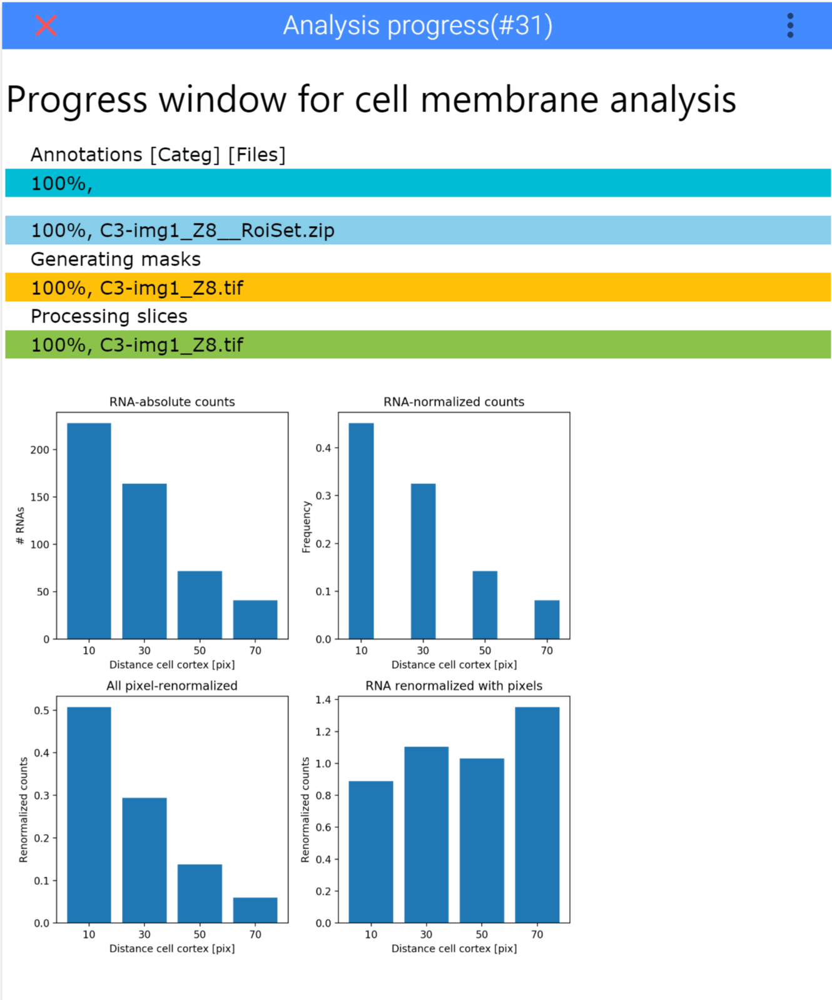
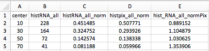
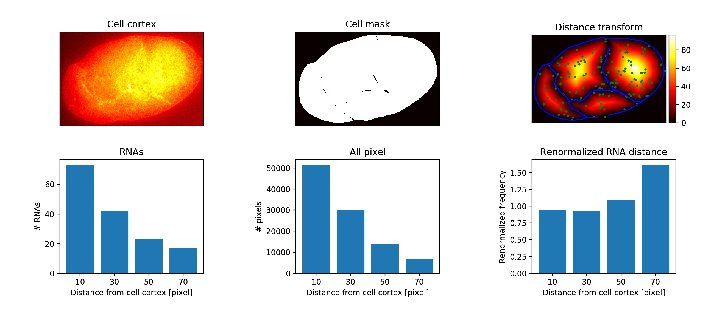

# RNA distance distribution to cell cortex
Workflow to quantify the distance distribution of RNAs to the cell membrane.

* <a href="https://bitbucket.org/muellerflorian/fish_quant/"  target="_blank">**FISH-quant**</a>
to detect RNA positions.
* **ImJoy**: you can install the plugin from <a href="http://imjoy.io/#/app?w=rna-loc-elegans&plugin=muellerflorian/parker-rna-loc-elegans:CellMembraneDistance@stable&upgrade=1" target="_blank">**here.**</a>

ImJoy plugins will be available in the workspace: **`rna-loc-elegans`**

You will also need the ImJoy plugin engine, please consult the
<a href="https://imjoy.io/docs/#/user-manual?id=python-engine/" target="_blank">**ImJoy documentation**</a>

## Test data
You can download already processed test data for the Cell membrane enrichment plugin, from 
the [**GitHub release page**](https://github.com/muellerflorian/parker-rna-loc-elegans/releases/tag/v2.0).

The zip archive contains data following the naming conventions of the examples below.

## Analysis overview
For each RNA, we determine the distance to the closest membrane. One thing to keep in mind more pixel close
to the membrane than far away, e.g. in the center of the cell. A simple example is a circle. The maximum distance that
you can be away from the “membrane” is the radius of the circle. However, there is only one possibility to be that far
away (in the center). Thus, there are many more “close” positions.  Plotting a histogram of the distance to the
membrane for all possible positions in the circle, will yield a distribution strongly enriched for small distances.

To normalised for this effect, we calculate all possible distance from the membrane
for a given cell with a **distance transformation**. This transformation results in
an image, where the pixel values are not fluorescence intensities but distance values. An example is shown below.
The blue lines are the cell outlines. The green dots are the detected RNAs. The image is the distance transform. The intensity values are distance to the membrane in pixels.


We measure for all RNAs the distance to the membrane and calculate a
histogram. We report the

-   Raw RNA distance histogram.
-   Normalised RNA histogram (values add to 1).
-   Normalised distance histogram of all pixels in the cell.
-   Normalised RNA histogram with the pixel histogram.


## Data organisation
We enforce a strict data organisation for this analysis.
More information about can be found in the dedicated section below.

1.  One folder per sample ("parental folder"). Images have to be stored as
    individual channels. More details for how to convert images are [here](image-processing.md#multi-channel-conversion).
2.  Each channel is saved as a separate `.tif` file containing all z-slices. Information
    for how to convert stacks can be found here are [here](image-processing.md#multi-channel-conversion).
3.  RNA molecules are detected with [FISH-quant](https://bitbucket.org/muellerflorian/fish_quant). Analysis results are also stored directly in the parental folder. RNA detection is described in more detail [here](rna-detection.md).
4.  Membrane annotations are stored in a dedicated subfolder `zstack_segmentation`.
    More information [below](cell-membrane-dist.md#annotations-of-cell-membrane).

As an example, we have one image `img1`  with 3 channels. The first channels contain
analysed smFISH data, the third one contains the cell membrane annotations for two Z slices (slice 3 and 8).

```
.
├─ img1/
│  ├─ C1-img1.tif                          # smFISH image (channel 1)
│  ├─ C1-img1__spots.txt                   # FQ detection results (channel 1)
│  ├─ C1-img1__settings_MATURE.txt         # FQ detection settings (channel 1)
│  ├─ C2-img1.tif                          # smFISH image of (channel 2)
│  ├─ C2-img1__spots.txt                   # FQ detection results (channel 2)
│  ├─ C2-img1__settings_MATURE.txt         # FQ detection settings (channel 2)
│  ├─ zstack_segmentation/
│  │  ├─ C3-img1_Z3.tif                    # Image of z-slice 1
│  │  ├─ C3-img1_Z3__RoiSet.zip            # Membrane annotation of slice 1
│  │  ├─ C3-img1_Z8.tif                    # Image of z-slice 2
│  │  ├─ C3-img1_Z8__RoiSet.zip            # Membrane annotation of slice 2
├─ img2/
.
```

## RNA detection
Detection of RNAs is performed with FISH-quant and detailed [here](rna-detection.md).

## Annotations of cell membrane
In order to be able to compute the enrichment towards cell membrane or nuclear
envelope, these membranes have to be annotated in EACH z-slice that should be
considered in the analysis. Below we describe a manual annotation with FIJI,
in the future automated segmentation results could be considered as well.

### Manual with FIJI
Annotations have to be performed and stored as described below.

1.  For each multi-channel image, the annotations are stored in a dedicated sub-folder
    called `zstack_segmentation`.
2.  Each annotated z-slice has to be saved as an individual image and the file name has to end with the
    corresponding z-slice `i` in the format `_Zi`. For instance, file name ends with `img1_ch3_Z3.tif`,
    where `3` is the actual slice number.

    In **FIJI**, open the z-stack and go to menu `Image` > `Stack` > `Stack to images`.
    You can then save each image with the according file-name.

3.  Annotations are stored with the name of the corresponding image, with the
    additional suffix `__RoiSet.zip`. For the example above, the added suffix would be `img1_ch3_Z3__RoiSet.zip`.

To perform the **actual annotation**, follow these steps

1.  Open FIJI.
2.  Open the **ROI manager**: `Analyze` > `Tools` > `ROI manager`
3.  Open/Select the image that you would like to annotate.
4.  Select the annotation tool of choice, e.g. freehand or polygon.
5.  Outline first structure of interest. When done, press `Add(t)` in the ROI manager to add outline to the out line manager.
6.  Proceed with all other structures. Enabling `Show all`, will show all defined regions.
7.  Save regions by highlighting all regions in the list and pressing on `More` >> `Save ...`
8.  If only one region is saved, this will created a file with the extension `.roi`, if multiple regions will be save this will create a `.zip` file. As a file-name choose the name of the annotated image, followed by the suffix `**__RoiSet.zip**`.

**IMPORTANT**: these annotations could be used for training of a neural network. If this is intended, then ALL structures, e.g. nuclei, have to be annotated. Unwanted elements, e.g. nuclei touching the cell border, can be removed in a post-processing step.


## Analysis with ImJoy
The entire functionality of the plugin can be controlled within the plugin
window. If you expand the plugin, you will see all parameters.



### Analysis parameters
All options are explained in the Table below. If you change these parameters, the
changed values will be saved in the browser and reused the next time you launch
ImJoy.

Option           | Type | Default     | Description
---------------- | ---- | ----------- | -----------
`dZ`             | int  | 2 | Number of z-slices that will be used above and below the currently analyzed slice. Specify this value > 0 if not all z-slices are annotated/
`Zmin`           | int  | 0 | Specify at which Z slice analysis should start. Value of 0 means that entire z-stack will be processed.
`Zmax`           | int  | 0 | As `Z min` but for maximum Z slice.
`Channel`        | str  | 'C3-'   | Unique identifier for channel containing annotations.
`Hist [bin]`    | int  |  20 | Bin size for histogram to measure membrane enrichment (in nm).
`Hist [max]`     | int  | 100 | Maximum value for bins to calculate membrane enrichment.
`FQ file` | str  |   | **FULL** path name for FQ file to be analyzed.

### Launch analysis and monitor progress
To analyze a FQ results file, you have to

1. Specify the required parameters in the plugin interface. 
    This includes to **copy & paste** the FULL name of the FQ results file that should be analyzed.
0. Execute plugin with clicking on the Plugin name `CellMembraneDist`. 
0. The specified file will then be processed and the final distance enrichment histogram
displayed in the interface. More plots and result files will be stored as detailed below.

Once you start the analysis, ImJoy will show you a progress window with progressbars
for the different steps. Once done, it will display the final result in this image.



### Saved results
The analysis script will create a new folder with the same name as the selected results file. To allow to redo the analysis with different settings, the plugin  will create for each performed analysis a separate sub folder `MembDist_yymmdd-hhmm`, where is a time-stamp in the format `yymmdd-hhmm`. This folder contains several files:

-   **\_DistanceEnrichmentSummary.png**: image containing the pooled analysis of all slices.

-   **\_HistogramPooled.csv**: csv file containing the histograms of the RNA-membrane distance pooled from all z-slices. This can be opened with any Spreadsheet application (Excel, LibreOffice, Numbers, ...) and results from different images
can then be pooled together. It contains the following data
    
    - `center`: center of the bins
    - `histRNA_all`: raw RNA distance histogram.
    - `histRNA_all_norm`: normalized RNA histogram (values add to 1).
    - `histpix_all_norm`: normalized distance histogram of all pixels in the cell.
    - `hist_RNA_all_normPix`: normalized RNA histogram with the pixel histogram.
      

-   **Z-i.png**: results of slice 'i':
    

-   **DataAll.json**: json file containing all analysis results including settings.

For the example data above, we would obtain the following folder structure
(shows only the relevant part for `C1-img1`):
```
.
├─ img1/
│  ├─ C1-img1.tif                          # smFISH image (channel 1)
│  ├─ C1-img1__spots.txt                   # FQ detection results (channel 1)
│  ├─ C1-img1__settings_MATURE.txt         # FQ detection settings (channel 1)
│  ├─ C1-img1__spots/
│  │  ├─ MembDist_181017-1629/
│  │  │  ├─ _HistogramPooled.csv
│  │  │  ├─ _DistanceEnrichmentSummary.png
│  │  │  ├─ DataAll.json
│  │  │  ├─ Z-1.png
│  │  │  ├─ Z-2.png
.
```
