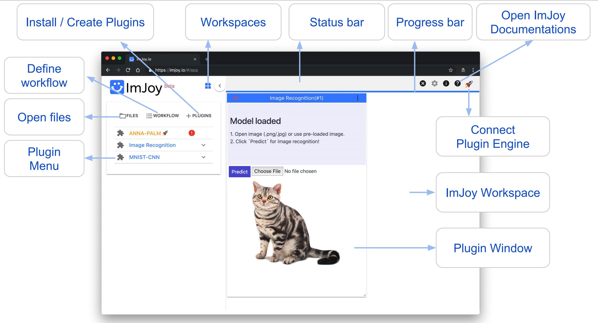
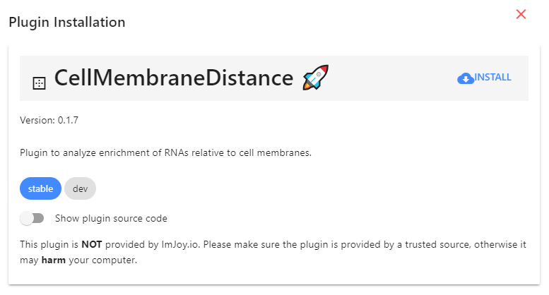
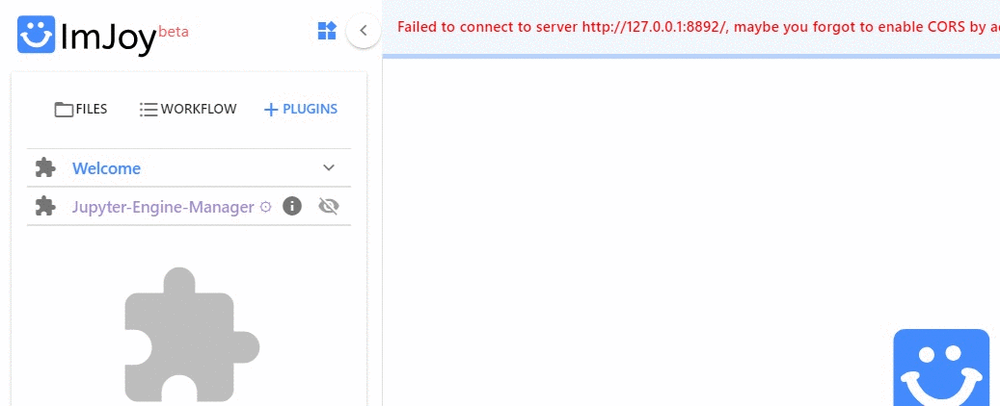
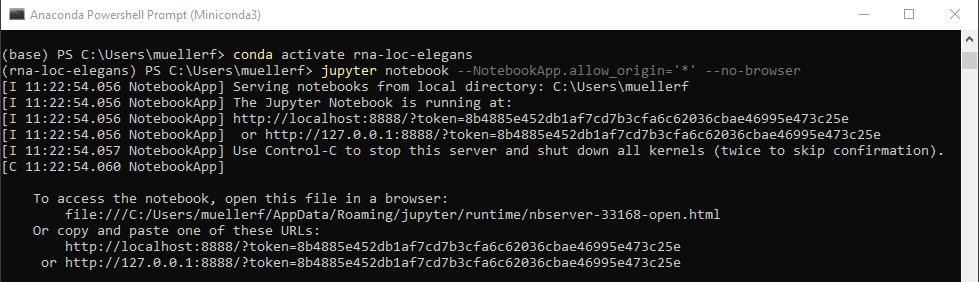

# Tools
Here we describe the tools that are used in the different analysis workflows, and when necessary how to install them. 
 
* **RNA detection** is performed with the Matlab package FISH-quant (more details [below](#fish-quant-rna-detection)).
* Most postprocessing steps are performed with **Python plugins running ImJoy**. To use them, you have to install **Python with Jupyter** and the necessary **ImJoy plugins**. For more details see the respective sections below.
* Some annotation tasks are performed with **Fiji**, which you can download from [**here**](https://fiji.sc/).

## FISH-quant: RNA detection

[**FISH-quant**](https://bitbucket.org/muellerflorian/fish_quant/) is a Matlab toolbox to
localize RNAs in 3D from smFISH images. FISH-quant is often used to perform the RNA
detection. Eventually, we would like to implement the main FISH-quant features in ImJoy.

</img>


## Python with Miniconda
We recommend installing an [Miniconda distribution of Python](https://docs.conda.io/en/latest/miniconda.html): choose Python 3.7 and your operating system. You  can then use the annoconda prompt to excecute the different commands listed below. 

We recommend creating a **dedicated environment** to run code in this analysis package. 
This guarantess that only necessary code is installed. Tos create an environment called `rna-loc-elegans`, open an anaconda prompt and type. Note that you will also install Jupyter, which will allow to run Python plugins in ImJoy.
Confirm with `y` when asked if you want to proceed (`Proceed ([y]/n)?`): 

```
conda create --name rna-loc-elegans python=3.7 jupyter
```

## ImJoy
[ImJoy](https://imjoy.io/docs/#/) is image processing platform with an easy
 to use interface. ImJoy can be used directly in your browser, without any prior installation. 

 While ImJoy is an app running in the browser, **NO** user data will be transferred over the internet. 
 
 Some important **features**:

 2. Specific functionality is provided by **plugins**, which can be installed with simple links. Available 
    plugins are listed in the plugin list on the left part of the interface. Depending on the implementation 
    plugins are either executed directly by pressing on their name, or a simple interface can be displayed when
    pressing on the arrow down symbol. 
 3. ImJoy can have several **workspaces**. Each workspace can contain multiple plugins and is often
    dedicated to a specific data processing task. Workspaces can be selected from little puzzle symbol in the upper left part of the interface.
 
    

### Installing plugins
We provide links to install ImJoy plugins for the different workflows. 
These installation links also specify in which **ImJoy workspaces** the plugin will be installed  

If you press on the installation link, the ImJoy web app will open and display a
dialog asking if you want to install the specified plugin. To confirm, press 
the `install` button.



Once installed, ImJoy remembers the workspaces and plugins and you simply have to
open the ImJoy app and select the workspace you want to use (which will be `rna-loc-elegans`) 
[https://imjoy.io/#/app](https://imjoy.io/#/app)



### Running Python plugins 
Most of the provided plugins use Python for the processing. In order for ImJoy these plugins, you have 
to connect ImJoy to a **Jupyter notebook**, which can be installed via Miniconda (see section about Python Installation [above](#python-with-miniconda)). 

Once installed, you start an Jupyter Notebook via the anaconda terminal, to which ImJoy can connect. 
Please note that this notebooks runs on your local machine, so no data-transfer over the internet is taking place. 



0. Start an **anaconda terminal**. 
1. **Activate the environment**:
    ```
    conda activate rna-loc-elegans
    ```
0. **Start Jupyter notebook**. Type
    ```
    jupyter notebook --NotebookApp.allow_origin='*' --no-browser
    ```
    Copy the provided URL including the token, e.g. in the screenshot below: `http://127.0.0.1:8888/?token=8b4885e452db1af7cd7b3cfa6c62036cbae46995e473c25e`
0. To **connect ImJoy to the notebook**, 
   
    1. go to the ImJoy app and press on the rocket symbol in the upper right corner, 
       select `Add Jupyter-Engine` and paste the URL from the step above. 
    2. Plugins will then be automatically **connected to this Jupyter Kernel**. You can verify this, 
       by clicking on the puzzle symbol next to the plugin name. Depending on the plugin, installation
       might take a while, during this period the plugin name will be in red.  

    
    
